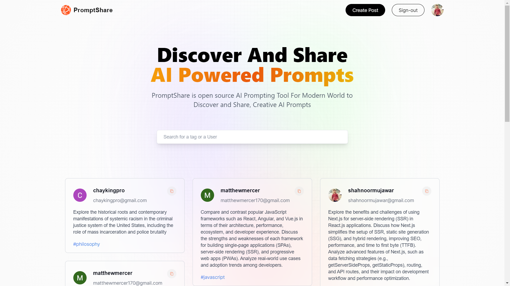

  

    
    
    
  

  <h3 align="center">Next.js 14 AI Prompt Sharing Application</h3

## 📋 <a name="table">Table of Contents</a>

1. 🤖 [Introduction](#introduction)
2. ⚙️ [Tech Stack](#tech-stack)
3. 🔋 [Features](#features)
4. 🤸 [Quick Start](#quick-start)
5. 🕸️ [Snippets](#snippets)
6. 🔗 [Links](#links)
7. 🚀 [More](#more)

## <a name="tech-stack">⚙️ Tech Stack</a>

- Next.js
- MongoDB
- NextAuth
- TailwindCSS

## <a name="features">🔋 Features</a>

👉 **Modern Design with Glassmorphism Trend Style**: A modern and visually appealing design, incorporating the glassmorphism trend style for a sleek and contemporary appearance.

👉 **Discover and Share AI Prompts**: Allow users to discover AI prompts shared by the community and create their own prompts to share with the world.

👉 **Edit and Delete Created Prompts**: Users have the ability to edit their created prompts at any time and delete them when needed.

👉 **Profile Page**: Each user gets a dedicated profile page showcasing all the prompts they've created, providing an overview of their contributions.

👉 **View Other People's Profiles**: Users can explore the profiles of other creators to view the prompts they've shared, fostering a sense of community.

👉 **Copy to Clipboard**: Implement a convenient "Copy to Clipboard" functionality for users to easily copy the AI prompts for their use.

👉 **Search Prompts by Specific Tag**: Allow users to search for prompts based on specific tags, making it easier to find prompts related to specific topics.

👉 **Google Authentication using NextAuth**: Enable secure Google authentication using NextAuth, ensuring a streamlined and trustworthy login experience.

👉 **Responsive Website**: Develop a fully responsive website to ensure optimal user experience across various devices, from desktops to smartphones

